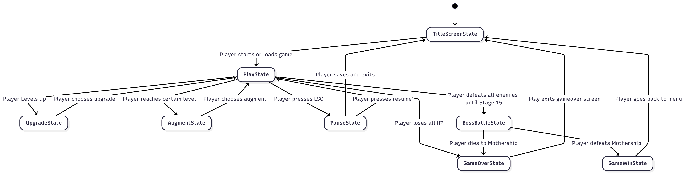
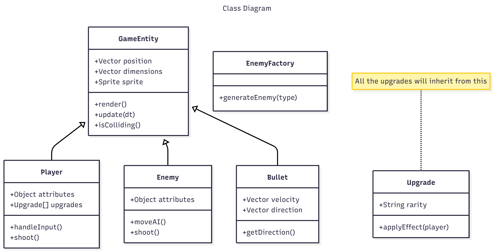

# Final Project

-   [ ] Read the [project requirements](https://vikramsinghmtl.github.io/420-5P6-Game-Programming/project/requirements).
-   [ ] Replace the sample proposal below with the one for your game idea.
-   [ ] Get the proposal greenlit by Vik.
-   [ ] Place any assets in `assets/` and remember to update `src/config.json`.
-   [ ] Decide on a height and width inside `src/globals.js`. The height and width will most likely be determined based on the size of the assets you find.
-   [ ] Start building the individual components of your game, constantly referring to the proposal you wrote to keep yourself on track.
-   [ ] Good luck, you got this!

---

# D-Rogue Proposal

## ✒️ Description

In this Diep.io inspired roguelike game, players will control a little tank that has to defeat many randomly generated enemies from a pool to beat levels. When tanks are killed, the player will gain XP and will be able to level up, leading to the roguelike genre. Players will be able to choose from a pool of different upgrades that will allow them to survive the later rounds. Different levels will lead to a single final battle against The Mothership.

## 🕹️ Gameplay

The game will begin with the player at level 1, each level different enemies will be generated for the players to defeat. Each enemy will award different amounts of XP, which will eventually lead to a level up. When the player levels up, the game will pause and switch to a screen with three different upgrades that they can choose from. Things like increasing bullet damage, bullet speed, reload speed or maybe even elemental damage. This loop will continue until a player reaches a certain level threshold (TBD) and they will be able to level up the tank itself. They can pick the "Twin" upgrade which adds a second cannon to the front of the tank which will make the tank shoot two bullets forward, the "Machine Gun" upgrade, which widens the cannon, leading to reload speed being much higher, the "Sniper" Upgrade which will make the cannon longer, leading to longer reload time, but much more damage and bullet speed and the "Flank Guard" upgrade which adds a cannon on the opposite side of the tank, for the enemies sneaking up on you. Gameplay will then continue normally until players reach level 15, the final level where a bossfight against The Mothership will start. The mothership is a tank with 16 cannons all around it that will shoot periodically that will make a more "Bullet-Hell" type of fight.

Once the player wins / loses, they will be sent back to the main menu (it will look GREAT) where they can either start a new run or restart a previous run if they decided to quit during a run.

When hitting "ESC" while player, a pause screen will appear allowing the player to resume or save and quit, reloading the run will restart from the start of the level, not from where they were exactly to make save-scumming less impactful.

## 📃 Requirements

1. The player should be able to start the game.
2. The player should be able to move on the map.
3. The player and enemies should sprites.
4. The player should be able to shoot bullets
5. Bullets should be able to move throughout the screen at a constant speed (probably will use matter).
6. Bullets should be deleted when off-screen to avoid lag.
7. The player should be able to see their health and the enemies health at all times.
8. Bullets should be able to hit the player and the enemies and be able to affect them.
9. Player should be able to win / lose.
10. Player should have a camera follow them so they can traverse the map.
11. Players should be able to reload their runs so they dont lose them on page exit.
12. Enemies should be randomly generated to abide to the roguelike genre.
13. Players should be able to select an upgrade when they reach a certain XP threshold.

### 🤖 State Diagram

> [!note]
> Remember that you'll need diagrams for not only game states but entity states as well.

### 🗺️ Class Diagram

### 🧵 Wireframes

> [!note]
> Your wireframes don't have to be super polished. They can even be black/white and hand drawn. I'm just looking for a rough idea about what you're visualizing.

-   _Let's Play_ will navigate to the main game.
-   _Upload Cards_ will navigation to the forms for uploading and parsing the data files for the game.
-   _Change Log_ will navigate the user to a page with a list of features/changes that have been implemented throughout the development of the game.

We want to keep the GUI as simple and clear as possible by having cards with relevant images to act as a way for the user to intuitively navigate the game. We want to implement a layout that would look like as if one were playing a match of the Pokémon Trading Card Game with physical cards in real life. Clicking on any of the cards will reveal that card's details to the player.

### 🎨 Assets

We used [app.diagrams.net](https://app.diagrams.net/) to create the wireframes. Wireframes are the equivalent to the skeleton of a web app since they are used to describe the functionality of the product and the users experience.

We plan on following trends already found in other trading card video games, such as Pokémon Trading Card Game Online, Hearthstone, Magic the Gathering Arena, and Gwent.

The GUI will be kept simple and playful, as to make sure the game is easy to understand what each component does and is, as well as light hearted to keep to the Pokémon theme.

#### 🖼️ Images

-   Most images will be used from the well known community driven wikipedia site, [Bulbapedia](https://bulbapedia.bulbagarden.net/wiki/Main_Page).
-   Especially their [Trading Card Game section](<https://bulbapedia.bulbagarden.net/wiki/Full_Art_card_(TCG)>).

#### ✏️ Fonts

For fonts, a simple sans-serif like Roboto will look quite nice. It's a font that is legible, light on storage size, and fun to keep with the theme we're going for. We also used a more cartoonish Pokemon font for the title screen.

-   [Pokemon](https://www.dafont.com/pokemon.font)
-   [Roboto](https://fonts.google.com/specimen/Roboto)

#### 🔊 Sounds

All sounds were taken from [freesound.org](https://freesound.org) for the actions pertaining to cards.

-   [Shuffle cards](https://freesound.org/people/VKProduktion/sounds/217502/)
-   [Flip card](https://freesound.org/people/Splashdust/sounds/84322/)

### 📚 References

-   [Pokemon Rulebook](http://assets.pokemon.com/assets/cms2/pdf/trading-card-game/rulebook/xy8-rulebook-en.pdf)
